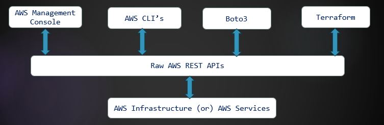

# AWS_Automation_By_Narendra_From_VRTechnologies

### 🚀 Coming Soon!

> **📢 Exciting News!**  
> We're currently working on a brand-new course, and it will be available soon on **[E-Learning](https://vrtech-narendra.github.io/e_learning/udemy_courses.html)**!  
> Stay tuned for hands-on lessons, real-world projects, and automation best practices.
>
> 
# 🚀 AWS Cloud Automation Guide

This guide introduces the core concepts of **AWS Cloud Automation**, including when to use scripting languages vs automation tools, and common use cases for each approach.

---

## 📌 What is AWS Cloud Automation?

**AWS Cloud Automation** is the process of automating repetitive and manual tasks in the AWS Cloud using **scripting languages** and **automation tools**.

### 🔁 Common Repetitive Tasks

- Deleting unused **EBS volumes**
- Terminating **idle or untagged EC2 instances**
- Cleaning up **unattached security groups**
- Removing **old Lambda function versions**
- Sending **resource usage reports** via email
- Creating **Amazon Machine Images (AMIs)**
- Provisioning environments for **dev, test, pre-prod, and prod**
- Setting up **identical environments** across multiple projects
- **Deploying packages** and **configuring servers**

---

## 🧰 Tools & Languages for AWS Automation

To automate AWS tasks effectively, we use a combination of **scripting languages** and **automation tools**.

### 💻 Scripting Languages:
- **Bash**
- **Python**
- **PowerShell**

### 🛠️ Automation Tools:
- **Ansible**
- **Terraform**
- **AWS CloudFormation**

---

## ❓ When to Use Scripting Languages vs Automation Tools

### ✅ Use **Scripting (Bash, Python, PowerShell)** When You Need To:

- Automate **AWS CLI** commands
- Query AWS data using **Boto3**, **jq**, or **JMESPath**
- Automate **instance patching**, **backups**, and **monitoring**
- Build **REST APIs** for AWS automation
- Perform **real-time, event-driven automation**

---

### ✅ Use **Automation Tools (Ansible, Terraform, CloudFormation)** When You Need To:

- Deploy AWS infrastructure (**EC2**, **S3**, **IAM**, **VPC**, etc.)
- Enforce **configuration management** (package installs, file updates, service management)
- Automate infrastructure deployments using **Infrastructure as Code (IaC)**
- Maintain **consistency across environments** (dev, staging, production)

---
### 🧠 How AWS Automation Works Behind the Scenes:
All scripting languages and tools communicate with AWS services using **REST APIs** under the hood.

- REST APIs are the **core of AWS** – they expose services like EC2, S3, IAM, etc. as programmable endpoints.
- Tools like **AWS CLI**, **Boto3**, **Terraform**, and the **AWS Console** use these APIs internally.

> **Note:** If you're good with REST API concepts, authentication, and XML parsing — you can directly automate AWS using **raw REST API calls** with tools like:
> - `curl` (Bash)
> - `requests` (Python)

## 👨‍💻 Target Audience

- DevOps Engineers
- Cloud Engineers & Architects
- System Administrators
- Python Developers working on cloud automation
- Anyone interested in **automating AWS with scripts and tools**

---

Happy Automating! ⚙️☁️
